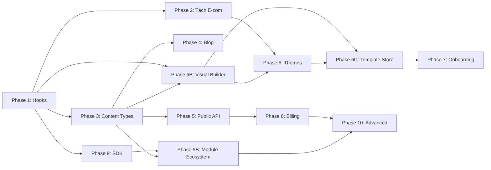

# 🗺️ Platform Roadmap — Overview

> **Vision**: Managed SaaS CMS Platform — WordPress + Shopify + Strapi  
> **Xem chi tiết Business Model**: [PLATFORM-ROADMAP.md](./PLATFORM-ROADMAP.md)

---

## 📂 Phase Documents

| Phase | File | Mô tả | Priority | Duration |
|-------|------|-------|----------|----------|
| 1 | [phase-01-hooks-system.md](./phase-01-hooks-system.md) | Hooks & Filters System | 🔴 Critical | 1–2 weeks |
| 2 | [phase-02-ecom-extraction.md](./phase-02-ecom-extraction.md) | Tách E-commerce ra Plugin | 🔴 Critical | 2–3 weeks |
| 3 | [phase-03-content-types.md](./phase-03-content-types.md) | Content Type System | 🟡 High | 2 weeks |
| 4 | [phase-04-blog-module.md](./phase-04-blog-module.md) | Blog Module | 🟡 High | 1–2 weeks |
| 5 | [phase-05-public-api.md](./phase-05-public-api.md) | Public REST API v1 | 🟡 High | 2–3 weeks |
| 6 | [phase-06-theme-marketplace.md](./phase-06-theme-marketplace.md) | Theme Marketplace | 🟠 Medium | 2–3 weeks |
| **6B** | [**phase-06b-visual-builder.md**](./phase-06b-visual-builder.md) | **Visual Page Builder & Custom UI** | **🔴 Critical** | **3–4 weeks** |
| **6C** | [**phase-06c-template-store.md**](./phase-06c-template-store.md) | **Template Store & Industry Builder** | **🔴 Critical** | **3–4 weeks** |
| 7 | [phase-07-onboarding.md](./phase-07-onboarding.md) | Onboarding & Site Templates | 🟠 Medium | 1–2 weeks |
| 8 | [phase-08-billing.md](./phase-08-billing.md) | Billing & Subscriptions | 🟠 Medium | 2–3 weeks |
| 9 | [phase-09-plugin-sdk.md](./phase-09-plugin-sdk.md) | Plugin SDK & Developer Platform | 🟢 Enhancement | 2 weeks |
| **9B** | [**phase-09b-module-ecosystem.md**](./phase-09b-module-ecosystem.md) | **Module Ecosystem & Plugin Architecture** | **🔴 Critical** | **2–3 weeks** |
| 10 | [phase-10-advanced.md](./phase-10-advanced.md) | Advanced Features | 🟢 Future | Ongoing |

## 📅 Timeline

```
Month 1:   Phase 1 (Hooks) ──→ Phase 2 (Tách E-com)
Month 2:   Phase 3 (Content Types) ──→ Phase 4 (Blog)
Month 3:   Phase 5 (Public API) + Phase 6B (Visual Builder — start)
Month 4:   Phase 6B (complete) + Phase 6 (Themes)
Month 5:   Phase 6C (Template Store & Industry Builder)
Month 6:   Phase 7 (Onboarding) + Phase 8 (Billing)
Month 7:   Phase 9 (SDK) + Phase 9B (Module Ecosystem & Plugin Architecture)
Month 8+:  Phase 10 (Advanced) + Community module development — ongoing
```

## 🔗 Dependencies



## 🎯 Customer Segment Coverage

```
Phase 5 (API)              → 10% khách (developers, headless)
Phase 6B (Visual Builder)   → 70% khách (SMBs, no-code users)  ← CRITICAL
Phase 6C (Template Store)   → 90% khách (mọi đối tượng)        ← GAME CHANGER
Phase 9B (Module Ecosystem) → 100% khách (mọi lĩnh vực)        ← WORDPRESS KILLER
Phase 6 (Themes)           → 20% khách (agencies, custom)
```

## 💰 Revenue Impact per Phase

| Phase | Revenue Source | Impact |
|-------|---------------|--------|
| Phase 8 (Billing) | Subscription plans | ⭐⭐⭐⭐⭐ Main revenue |
| Phase 6C (Template Store) | Template marketplace 30% commission | ⭐⭐⭐⭐ Recurring |
| Phase 9B (Module Ecosystem) | Plugin marketplace 30% commission | ⭐⭐⭐⭐ Long-term |
| Phase 9 (Plugin SDK) | Developer ecosystem growth | ⭐⭐⭐ Enabling |
| Phase 5 (API) | API usage overage fees | ⭐⭐ Niche |

## 📊 Module Coverage

| Category | Core | Community | Premium | Total |
|----------|------|-----------|---------|-------|
| E-commerce | 7 | 5 | 2 | 14 |
| Content | 3 | 4 | 0 | 7 |
| Education | 1 | 4 | 0 | 5 |
| Booking | 1 | 4 | 0 | 5 |
| Directory | 0 | 4 | 1 | 5 |
| Community | 1 | 3 | 1 | 5 |
| Industry | 0 | 8 | 2 | 10 |
| Utilities | 5 | 8 | 1 | 14 |
| **TOTAL** | **18** | **40** | **7** | **65** |
